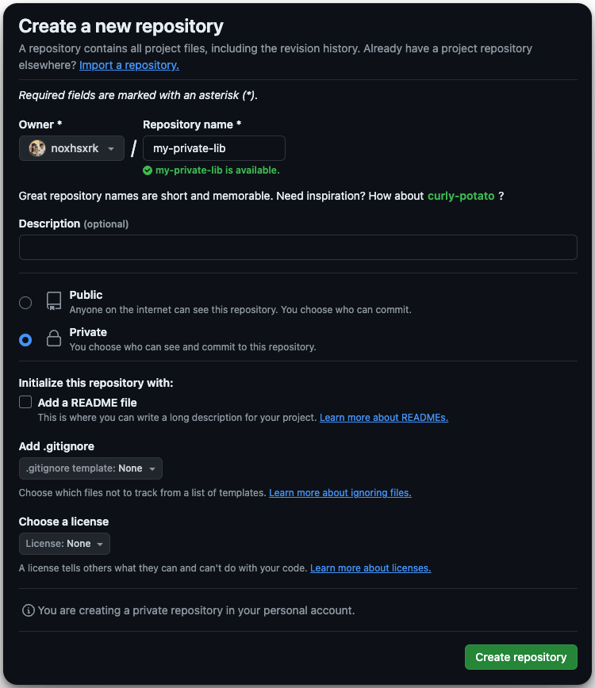
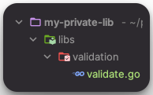
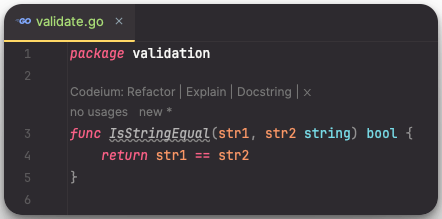
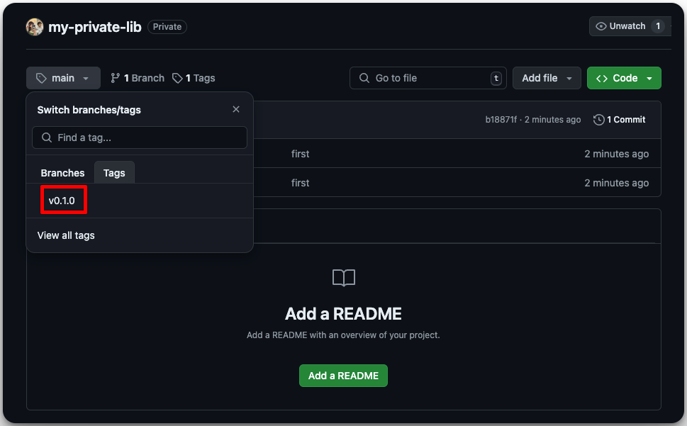
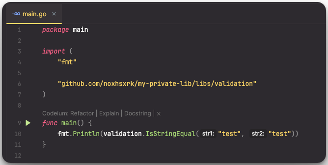
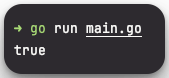

# Contents
 - [เริ่มต้นสร้าง Library ส่วนตัว](#create-lib)
 - [การเรียกใช้งาน Library](#lib-usage) 
 - [สรุปข้อดีของการสร้าง private library ใช้งานเอง](#summary)

ในหลายๆ โปรเจค การเขียนโค้ดซ้ำๆ กันหลายๆ ที่ เป็นสิ่งที่น่าเบื่อหน่าย และอาจทำให้เกิด Bug ได้ง่าย

Go Module เข้ามาช่วยแก้ปัญหานี้ได้ โดยการช่วยให้เราสามารถสร้าง Library ส่วนตัว
และใช้งานในโปรเจคต่างๆ ได้โดยไม่ต้องเขียนโค้ดซ้ำ

<span id="create-lib">
## เริ่มต้นสร้าง Library ส่วนตัว
</span>

 1. สร้าง Repo ใหม่ ตั้งชื่อที่ต้องการได้เลย ในที่นี้ขอตั้งชื่อว่า my-private-lib นะครับ
    
 2. clone Repo ของเรามาตามปกติ และทำการ go mod init
    ```sh
    git clone https://github.com/<username>/<repo-name>
    go mod init github.com/<username>/<my-private-lib>
    ```

    _example_
    ```sh
    git clone https://github.com/noxhsxrk/my-private-lib
    go mod init github.com/noxhsxrk/my-private-lib
    ```
 3. สร้าง folder structure ในแบบที่ต้องการ เช่น
    
    เราจะสร้าง ไฟล์ validate.go ใน folder libs/validation
 4. เขียน function ที่ต้องการ
    ในที่นี้จะลองเขียน function IsStringEqual ที่รับ 2 ตัวคือ string 2 ตัว ที่ต้องการเปรียบเทียบว่าเป็นค่าเดียวกันหรือไม่
    
    ```go
    func IsStringEqual(str1, str2 string) bool {
	    return str1 == str2
    }
    ```
 5. git add, git commit and git push ท่าประจำ
    ```sh
    git add .
    git commit -m "add new function"
    git push
    ``` 
 6. git tag 
    ```sh
    git tag v0.1.0
    git push origin v0.1.0 
    ```
    เพื่อความชัวร์ว่าเรา tag สำเร็จแล้ว ก็เข้าไปดู repo เราใน github ได้ว่ามี tag ที่เราเพิ่งจะติดไปขึ้นไปแล้ว
    

เย่เสร็จแล้ววววในขั้นตอน release ต่อไปเราจะไปเรียกใช้ library ส่วนตัวเพื่อใช้งานในโปรเจคต่างๆ

<span id="lib-usage">
## การเรียกใช้งาน Library
</span>

 1. setup
    เนื่องจาก repo ที่เราสร้างเราทำเป็น private repo เราเลยต้อง set go env กันก่อน
    ```sh
    git config --global --add url."git@github.com:".insteadOf "https://github.com/"
    go env -w GOPRIVATE="github.com/<github-username>"
    ```
 2. go get!!
    ```sh
    go get github.com/<github-username>/<repo-name>
    ```
    _example_
    ```sh
    go get github.com/noxhsxrk/my-private-lib
    ```
 3. เรียกใช้
    
 4. run!!
    

เย่ ก็จบไปแล้วนะครับกับการสร้าง Library ส่วนตัว และ การเรียกใช้งานในโปรเจค หวังว่าจะเป็นประโยชน์ไม่มากก็น้อยสำหรับคนที่กำลังศึกษา Golang นะครับ


<span id="summary">
## สรุปข้อดีของการสร้าง private library ใช้งานเอง
</span>
**ข้อดีหลักๆ**
 - Reducing Code Duplication: แทนที่จะเขียนโค้ดฟังก์ชันการทำงานเดียวกันซ้ำๆ ในหลายๆ โปรเจค การสร้าง private library ช่วยให้เราเขียนโค้ดฟังก์ชันนั้นๆ เพียงครั้งเดียว และสามารถนำไปใช้ซ้ำในโปรเจคต่างๆ ได้โดยไม่ต้องเขียนใหม่ ช่วยประหยัดเวลาและลดความซ้ำซ้อน
 - Minimizing Bugs: เมื่อโค้ดถูกเขียนไว้ในที่เดียว การแก้ไข Bug ก็จะง่ายและสะดวกกว่า เพราะเราต้องแก้ไขเพียงจุดเดียว แทนที่จะแก้ไขหลายๆ ที่ อีกทั้งยังช่วยลดโอกาสเกิด Bug ใหม่จากการเขียนโค้ดซ้ำๆ
 - Easier Maintenance: การจัดการกับโค้ดที่กระจายอยู่หลายๆ ที่ ย่อมยากกว่าการจัดการโค้ดที่รวมอยู่ในที่เดียว การสร้าง private library ช่วยให้เราสามารถจัดการโค้ดได้ง่ายขึ้น ติดตามการเปลี่ยนแปลง และอัปเดตเวอร์ชันได้สะดวก
 - Reusability: การสร้าง private library ช่วยให้เราสามารถนำโค้ดที่เขียนไว้แล้วไปใช้ซ้ำในโปรเจคอื่นๆ ได้ โดยไม่ต้องกังวลเรื่องความเข้ากันได้ หรือปัญหาอื่นๆ
 - Increased Work Efficiency: การใช้ private library ช่วยให้เราทำงานได้รวดเร็วขึ้น ประหยัดเวลา และลดโอกาสเกิดข้อผิดพลาด

**ข้อดีแบบผลพลอยได้**

- Readability: โค้ดใน private library มักถูกเขียนขึ้นมาเพื่อใช้งานเฉพาะ จึงมีโครงสร้างที่เรียบง่าย อ่านเข้าใจง่าย
- Testing: การเขียน Test ใน private library มักง่ายกว่าการทดสอบโค้ดที่กระจายอยู่หลายๆ ที่

โดยสรุปแล้ว การสร้าง private library นั้นมีข้อดีมากมาย  ช่วยให้นักพัฒนาซอฟต์แวร์ทำงานได้มีประสิทธิภาพมากขึ้น  ประหยัดเวลา  และลดโอกาสเกิดข้อผิดพลาด