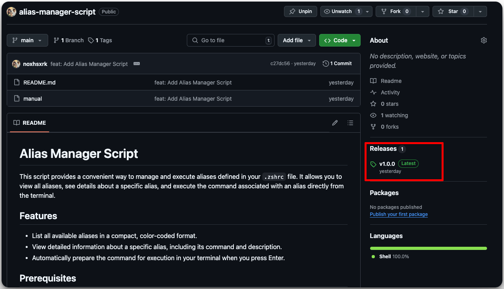
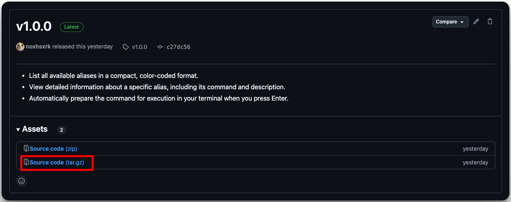
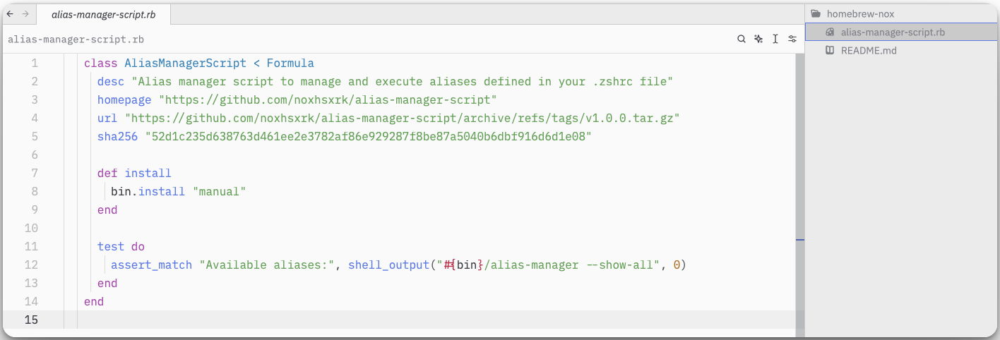

การสร้าง Homebrew package นั้นเป็นเรื่องที่ง่ายมาก สำหรับมือใหม่ที่อยากจะทำ script หรือ software ต่างๆให้คนอื่นใช้ บทความนี้จะสอนคุณตั้งแต่ setup ไปจนถึงเอาขึ้น homebrew เล้ยยย

## 1. Homebrew คืออะไร

Homebrew เป็นระบบจัดการแพ็กเกจที่ช่วยให้การติดตั้งซอฟต์แวร์บน macOS และ Linux ง่ายขึ้น โดยใช้คำสั่งง่าย ๆ ในการติดตั้ง อัปเดต และจัดการซอฟต์แวร์ต่าง ๆ

- **ความนิยม**: Homebrew ได้รับความนิยมอย่างมากในหมู่นักพัฒนาเนื่องจากความง่ายในการใช้งานและการจัดการ dependencies
- **ประโยชน์**: ช่วยลดความซับซ้อนในการติดตั้งซอฟต์แวร์และทำให้การอัปเดตเป็นไปอย่างราบรื่น

## 2. สร้าง Package ที่จะเอาขึ้น Homebrew พร้อมติด Tag

ก่อนที่คุณจะสร้าง Homebrew package คุณต้องเตรียมซอฟต์แวร์ของคุณให้พร้อม:

- **ใช้ Git**: ก็ทำเหมือนปกตินั้นแหละเอาโค้ดขึ้น git แล้ว ติด tag ซะ

``` bash
git tag -a v1.0.0 -m "Release version 1.0.0"
git push origin v1.0.0
```


- จะเห็นว่าเราติด tag เรียบร้อยละ ลองกดเข้าไป


- แล้วก็ก็อป path ตัว Source code (tar.gz) เก็บไว้นะ หน้าตามันจะประมานนี้
```bash
https://github.com/noxhsxrk/alias-manager-script/archive/refs/tags/v1.0.0.tar.gz
```
## 3. สร้าง Homebrew.&lt;name&gt; Repo

การสร้าง repository บน GitHub เป็นขั้นตอนสำคัญในการ publish package:

- **สร้าง Repository**: สร้าง repository ใหม่ใน GitHub โดยใช้ชื่อในรูปแบบ `homebrew-<name>` เช่น noxhsxrk.nox (ของผมเอง)
- **ตั้งค่าเบื้องต้น**: เพิ่ม README.md และ LICENSE เพื่อให้ข้อมูลเกี่ยวกับแพ็กเกจของคุณ

## 4. เขียน Formula สำหรับ Homebrew

Formula เป็นสคริปต์ Ruby ที่บอก Homebrew ว่าจะติดตั้ง package ยังไง:

- **สร้าง Formula**: ใช้คำสั่ง `brew create` เพื่อสร้าง template ของ formula

``` bash
brew create https://github.com/noxhsxrk/alias-manager-script/archive/refs/tags/v1.0.0.tar.gz
```

หลังจาก รัน brew create เราจะได้ file .rb มา เราก็ทำการ cp มาไว้ใน repo noxhsxrk.nox ของเรา

## 5. Config Ruby File



และทำการ push ขึ้น github repo noxhsxrk.nox ของเราไปเลยยย

## 6. Install your package

ก็แค่
```bash
brew tap noxhsxrk/nox
brew install alias-manager-script
```
ก็ใช้ได้แล้วครับบบ
